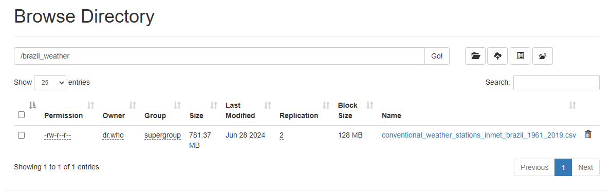
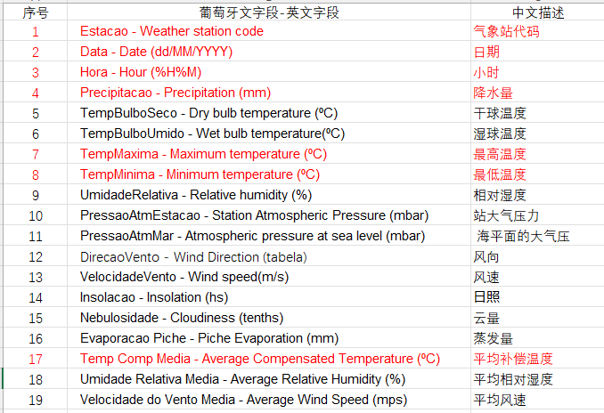

部署时要按照情况在

**src/main/java/resources**

下修改hbase-site.xml配置文件

数据集为[Brazil Weather, Conventional Stations (1961-2019)](https://www.kaggle.com/datasets/rogerioifpr/brazil-weather-conventional-stations-19612019)

将数据集中的conventional_weather_stations_inmet_brazil_1961_2019.csv
上传到hadoop中

数据集中数据含义如下:

